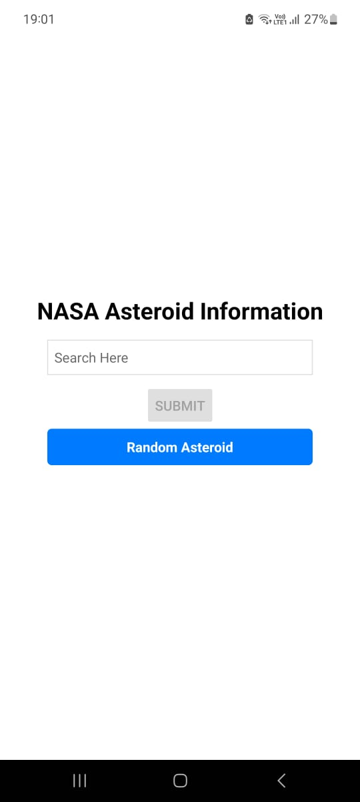
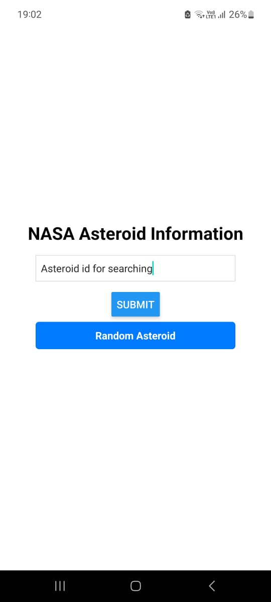
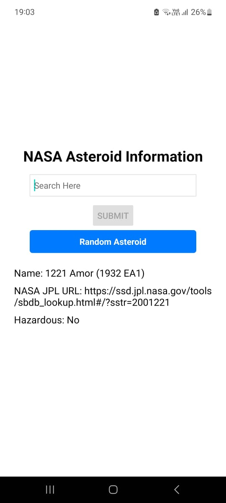
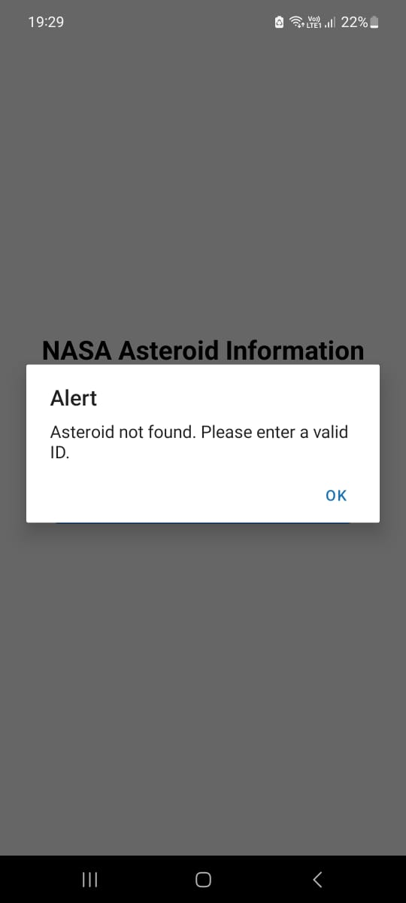

# NASA Asteroid Explorer App

This app provides information on asteroids by fetching data from NASA's NEO API.

## Screenshots

### Main Screen

### Submit Button Enabled upon entering text in the input field

### Random Asteroid Details fetched

### Alert Screen
